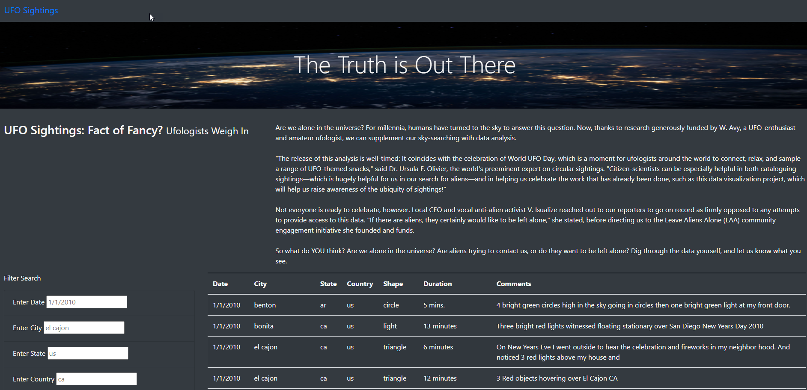
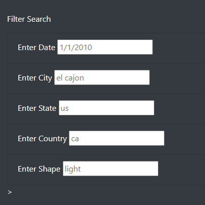
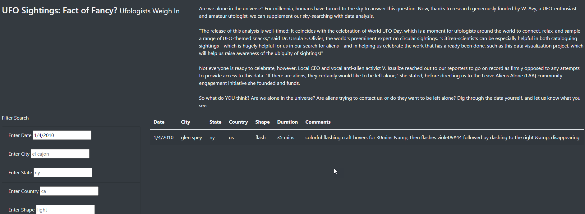

# UFOs
## Overview
The purpose of this project was to allow users to view and filter out UFO data not only by date, but also by city, state, country and shape and build a dynamic website. The information needs to aesthetic while also being organized and easy to use. To do this filtering, we will utilize JavaScript function, to build the table, and loop through the data. 
## Results
This is the result of the webpage that was created. 

In the box under the filter search enter in the filter for the field identified. For example, in Date, enter the date, enter the City for City and state for state. 

Data in the search criteria should not include blank and spaces. As you enter data into the filters, the table on the right will automatically start filtering the information. Not all filters are required

## Summary
One drawback to this design is that the user must be very specific in the fields that they use. They cannot include uppercase lettering or enter spaces. Users must type in the exact same item that is listed in the table, but this is not always known
The following are two recommendations for further development:

* Allow for modifications to the filter so that partial fields can be filled out or users can capitalize and still get the same data
* Create an apply and clear filter button. It is not always clear that a filter is being applied, or having the user go into each filter criteria and clear the filter to get back to the full list of results. Having this enhancement will improve the functionality of the webpage
